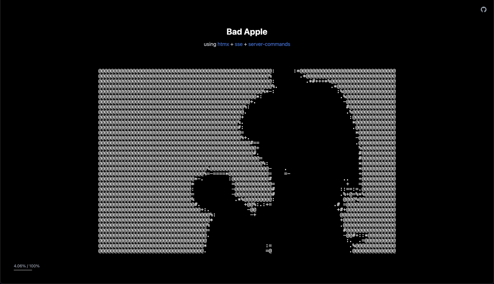

# Bad Apple

The Bad Apple animation as ASCII art rendered in real-time from the server @ 60 FPS using [**htmx**](https://htmx.org/) + [**sse extension**](https://htmx.org/extensions/sse/) + [**server-commands extension**](https://github.com/scriptogre/htmx-extensions/tree/feature/server-commands/src/server-commands).



## Quick Start

```bash
cp .env.example .env
docker compose up
```

## How it works

The `server-commands` extension provides a special `<htmx>` tag. The server streams `<htmx>` tags ~60 times/second via SSE to update multiple elements in real-time:

```html
data: <htmx target="#frames" swap="textContent">{frame}</htmx>
data: <htmx target="#progress-text" swap="textContent">{progress}%</htmx>
```

You can read more about it in the extension's [README.md](https://github.com/scriptogre/htmx-extensions/tree/feature/server-commands/src/server-commands).